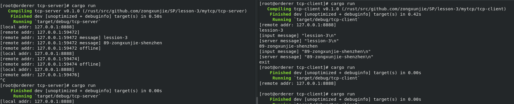

# lesson 3
## 数据类型
* int: i8 i16 i32 i64 isize: 116_i8, 0xcafe_u32, 0b0010_1010, 0o106
* uint: u8 u16 u32 u64 usize,使用as类型转换会填充或截短，-1_i16 as i32, 1000_i16 as u8
* bool 必须为true/false，不能用if x {...}, 只能if x != 0 {...},虽然一位，但是内存中使用一个字节。
* tuple 元组，数据类型可以不一致，常用在函数入参或返回值。
* array 数组，长度固定，类型一致
* vec 向量，长度可变，类型一致，push追加 pop删除最后一个元素，insert(3,35)在索引3处插入35,remove(2)，在索引2处删除一个元素。
* struct 类型组合
* enum 类型灵活，只会出现一种情况时使用
* string 拥有所有权
* str 字符串切片，需要引用&使用
* map 字典
>* hashmap 
>* btreemap 可以比较大小，排序，但插入慢
* set 只有一个字段
>* hashset
>* btreeset

## 类型转换
* as
>* int与uint可以用as,会填充或截短
>* bool，可以assert_eq!(true as i32, 1);但不能反向转换，只能返回比较表达式，如 x != 0
>* char, 可以转换为其他类型assert_eq!('*' as i32, 42);，但只有u8可以转换为char类型

## 流程
* 判断：
>* if{} else{}
>* match{case}
* 循环：
>* loop {break}
>* while 条件{}
>* for 条件{}
* option<T>避免空指针操作
* result<T, E>处理错误

## Cargo
* cargo new (--lib)
* cargo build (--release)
* cargo run
* cargo check
* cargo test

## Cargo.toml Cargo.lock

## node-template v3.0.0
* 属性宏替换原来的过程宏，更贴合rust语法
* node
>* cli
>* command
>* service config
* lib
* runtime
>* pallet weight

## 作业
使用Rust std标准库的功能实现一个tcp server，可参考网上代码自行修改，最终需要各位同学上传代码和运行结果的截图
* 要求：
>* 能正常运行
>* 对tcp client(比如可用telnet等)发过来的消息，打印，并做echo返回
>* 对代码每一句做注解
>* 做一次标准的错误处理（模式匹配）
* 通过本次作业，做到：
>* 理解Rust中的基本结构语法
>* 理解Rust中的基本控制流程用法
>* 理解基本的模式匹配
>* 理解错误处理的基本模式
>* 了解标准库中的一些功能

## 答案
* 运行截图

* 对tcp client(比如可用telnet等)发过来的消息，打印，并做echo返回
>* 客户端发送lession-3：server成功接收打印后将原信息发回客户端
>* 客户端发送89-zongxunjie-shenzhen：server成功接收打印后将原信息发回客户端
>* 客户端发送exit：退出客户端
>* 客户端发送空字符串：退出客户端
* 对代码每一句做注解
> 见代码
* 做一次标准的错误处理（模式匹配）
>* server程序中对stream进行match，分别处理正常情况和异常情况，详细见代码。