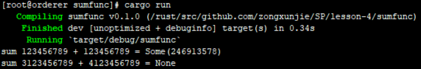

# Rust 进阶

## 课后作业
* 1 为枚举交通灯实现一个trait，trait里包含一个返回时间的方法，不同的灯持续的时间不同，可以上传代码片段，或者代码的链接；
>* 我的实现代码
```rust
// 引入标准库时间类型
 use std::time::Duration;
 
 // 定义交通灯枚举类型
 enum TrafficLight {
     Red,
     Yellow,
     Green,
 }
 
 // 定义trait，打印交通灯时间
 pub trait TrafficTime {
     fn light_time(&self) -> Duration;
 }
 
 // 为TrafficLight实现trait
 impl TrafficTime for TrafficLight {
     fn light_time(&self) -> std::time::Duration {
         // 模式匹配
         match &self {
             // 打印不同时间
             TrafficLight::Red => Duration::new(30, 0),
             TrafficLight::Yellow => Duration::from_secs(3),
             TrafficLight::Green => Duration::from_secs(60),
         }
     }
 }

// 函数入口
fn main() {
    // 定义枚举变量
    let red_light = TrafficLight::Red;
    let yellow_light = TrafficLight::Yellow;
    let green_light = TrafficLight::Green;
    //打印对应的交通灯时间
    println!("red light time: {:?}", red_light.light_time());
    println!("yellow light time: {:?}", yellow_light.light_time());
    println!("green light time: {:?}", green_light.light_time());
}
```
>* 运行截图
* 2 实现一个函数，为u32类型的整数集合求和，参数类型为&[u32]，返回类型为Option<u32>，溢出时返回None，可以上传代码片段，或者代码的链接；
>* 我的实现代码：
```rust
// 定义求和函数，返回Option，当类型溢出时输出None，否则输出变量和值
fn sum_check(x: u32, y: u32) -> Option<u32> {
    // 判断是否会溢出
    if x > u32::MAX - y {
        None
    } else {
        Some(x + y)
    }
}

// 函数入口
fn main() {
    // 不会溢出情况
    let x = 123456789;
    let y = 123456789;
    println!("sum {:?} + {:?} = {:?}", x, y, sum_check(x, y));
    // 会发生溢出情况
    let m = 3123456789;
    let n = 4123456789;
    println!("sum {:?} + {:?} = {:?}", m, n, sum_check(m, n));
}
```
>* 运行截图
* 3 实现一个打印图形面积的函数，它接收一个可以计算面积的类型作为参数，比如圆形，三角形，正方形，需要用到泛型和泛型约束，可以上传代码片段，或者代码的链接。
>* 我的实现代码：
```rust
// 定义trait
trait Geometry {
    // 定义trait行为实现的方法
    fn area(&self) -> f64;
}

// 三角形
struct Triangle {
    length: f64, // 长边
    height: f64, // 高
}

// 为三角形实现trait
impl Geometry for Triangle {
    // 计算面积
    fn area(&self) -> f64 {
        self.length * self.height / 2.0
    }
}

// 圆形
struct Circle {
    diameter: f64,
}

// 为圆形实现trait
impl Geometry for Circle {
    // 计算面积
    fn area(&self) -> f64 {
        let pi = std::f64::consts::PI;
        pi * self.diameter * self.diameter / 4.0
    }
}

// 长方形
struct Rectangle {
    length: f64, // 长
    width: f64,  // 宽
}

// 为长方形实现trait
impl Geometry for Rectangle {
    // 计算面积
    fn area(&self) -> f64 {
        self.length * self.width
    }
}

// 输入泛型形状（泛型约束），打印面积
fn notify(item: impl Geometry) {
    println!("Geometry area is: {:?}", item.area());
}

// 函数入口
fn main() {
    // 定义三角形实例
    let tri = Triangle {
        length: 6.0,
        height: 3.0,
    };
    // 打印三角形面积
    notify(tri);
    // 定义圆形实例
    let cir = Circle { diameter: 10.0 };
    // 打印圆形面积
    notify(cir);
    // 定义长方形实例
    let rec = Rectangle {
        length: 5.0,
        width: 4.0,
    };
    // 打印长方形面积
    notify(rec);
}
```
>* 运行截图