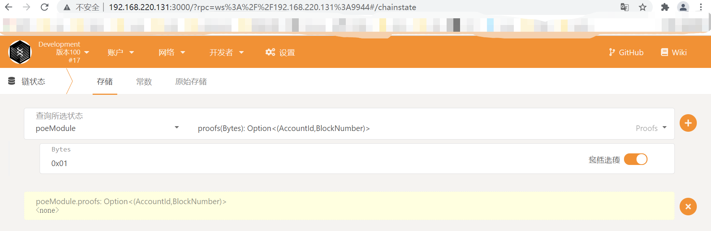
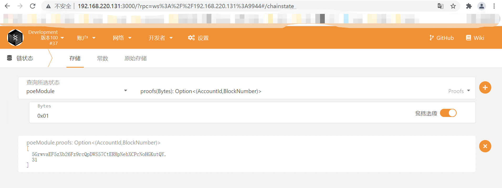
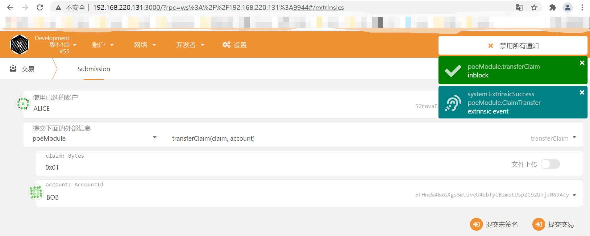
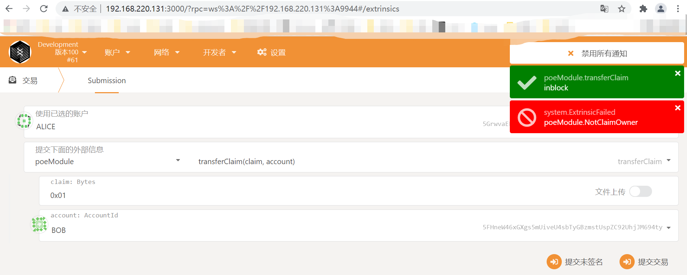
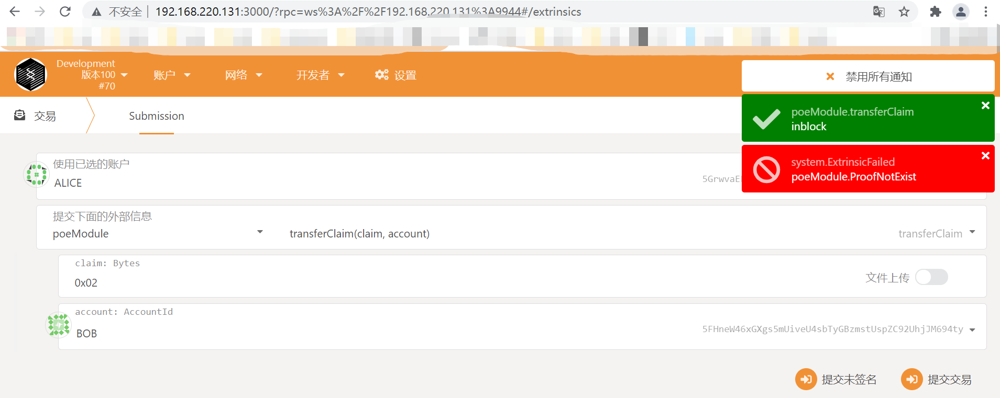
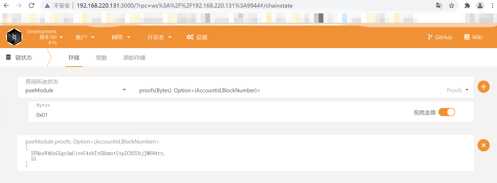
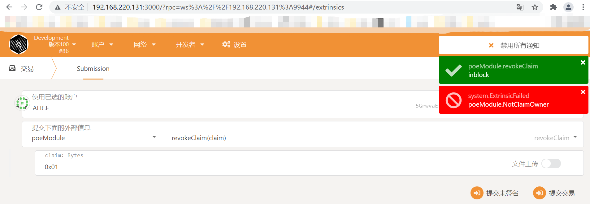
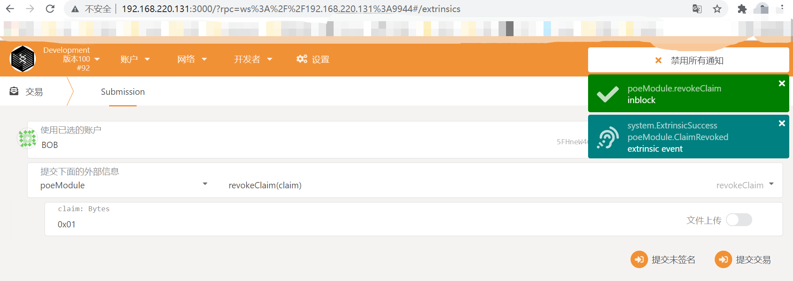
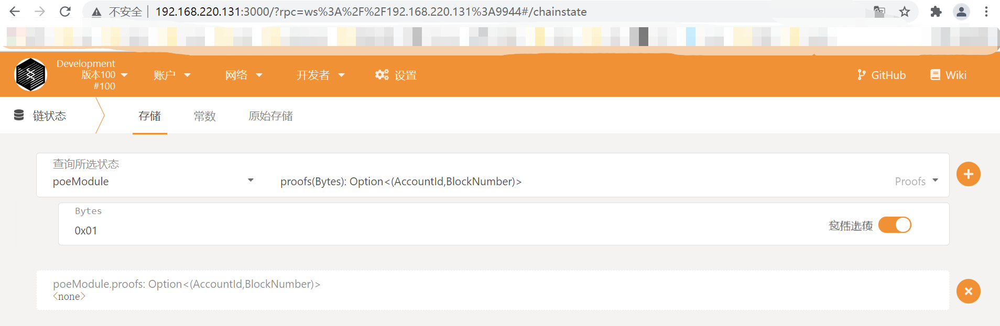

# substrate存证
* Rust宏
* Runtime常用的宏
* cargo expand
* 其它宏
## Rust 宏
宏（Macro）是一种元编程的方式，常见的还有Java里的反射，Rust提供了两种宏：
* 声明宏
* 过程宏
> https://doc.rust-lang.org/book/ch19-06-macros.html

##Substrate为什么使用宏
为了简化Runtime的开发，Substrate使用宏建立了一套DSL（Domain Specific Language），设计合理的DSL可以：
* 很好的被用户理解
* 代码更加简洁，提升效率
* 解放应用开发者，只需实现业务组件

## Substrate Runtime定义
State A 转到 State B，需要通过交易进行触发和Runtime逻辑来修改。
* 内置的模板也称为pallet（调色板）
* 常见的pallet有：assets, babe, balances, collective, contract, democracy, elections, grandpa, indices, grandpa, identity, membership, offences, session, staking, sudo, system, timestamp, treasury, and more...

## Runtime模块的组成
使用Substrate进行Runtime模块开发的过程中，常用到的宏有：
* frame_support::pallet 定义功能模块
* pallet::config 定义配置接口
* pallet::storage 存储单元
* pallet::event 事件
* pallet::error 错误信息
* pallet::call 包含可调用函数
* pallet::hooks 区块不同时期的执行逻辑
* construct_runtime 添加模块到Runtime

## storage宏
不管是web2.0传统的互联网应用，还是采用区块链技术的web3.0应用，关键数据都需要存起来。

storage宏，就是来定义runtime模块的存储单元。

## storage宏举例
fram_support::pallet用来定义新的功能模块，这里功能模块名字为pallet
```rust
#[frame_support::pallet]
pub mod pallet {
    // -- snippet --
}
```
使用pallet::config来定义功能模块配置接口，这里定义配置接口Config来继承system模块config
每个功能模块都要继承系统模块
当前功能模块配置接口里的关键类型为event，这个event有两个类型约束，
一个是它可以从自己模块的event进行转换，并且他是系统模块event这样一个类型

```rust
#[pallet::config]
pub trait Config: fram_system::Config {
    type Event: From<Event<Self>> + IsType<Self as frame_system::Config>::Event>;
}
```
使用pallet::storage宏，待会介绍pallet::getter宏
这里定义一个类型别名Something，真实类型为StorageValue，有两个泛型参数，一个是下划线，
第二个为u32，表示真实的Something这样一个存储单元所存储的数据类型，也就是无符号32位的整数类型。
第一个下划线参数，表示的是存储单元对应的一个prefix，通常情况下，我们用下划线进行表示。
当我们需要修改存储单元的prefix单元时，才需要重新定义。
pallet::getter宏定义一个可选的getter函数，这里它的getter函数是something，这样我们可以很方便的使用这个getter函数
来获取对应的存储单元的内容
定义存储单元时，泛型参数T是不可缺省的。它和标准Rust语法不一样。
```rust
#[pallet::storage]
#[pallet::getter(fn something)]
pub type Something<T> = StorageValue<_,u32>;
```

数据类型：
* 单值 StorageValue
* 映射 StorageMap
* 双键映射 StorageDoubleMap

## call宏
区块链的链上状态变化由交易触发，Substrate不仅支持自定义的存储数据结构，
还支持自定义的交易，例如转账、注册身份、投票等等，也叫做extrinsic外部交易。

call用来定义模块里可调用函数，每一个外部交易都会触发一个可调用函数，并
根据交易体信息也就是函数参数，更新链上状态。

## call宏举例
```rust
#[pallet::call]
impl<T: Config> Pallet<T> {
    #[pallet::weight(10_000)]
    pub fn do_something(origin: OriginFor<T>, something: u32) -> DispatchResultWithPostInfo {
        let who = ensure_signed(origin)?;
        
        // Update storage.
        <Something<T>>::put(something);
    
        // Emit an event.
        Self::deposit_event(Event::SomethingStored(something, who));
    
        Ok(().into())
    }
}
```
之前定义了一个pallet结构体表示一个功能模块，接下来对pallet结构体添加一些功能实现
在这些功能实现外面我们应用了pallet::call宏，来表示这个实现里面是我们可调用函数，对应的是不同的交易
这里面其中一个可调用函数名字是do_something，可接收两个参数，其中一个参数是origin，表示交易的发送方，类型是OriginFor，
来自系统模块，另外一个数据参数是something是u32整数类型。返回结果是DispatchResultWithPostInfo，
是一个 rust result 类型的类型别名，包含了substrate所返回的一些自定义错误信息。
pallet::weight这个宏，稍后介绍
在这个可调用函数里逻辑很简单，首先使用系统模块提供的ensure_signed将origin进行校验，
看对应的交易发送方是不是经过签名的，如果是签名的话，返回交易发送方对应的Account，
校验完成之后，对存储单元进行修改，将Something存储单元里面存储值进行更新，使用put函数。
接下来触发一个事件来告诉客户端，逻辑执行成功了。我们触发的事件是SomethingStored这样一个事件，
他有两个数据，一个是something表示更新的数据信息，以及who表明谁来更新的
最后返回OK，将类型进行转换，转换成一个合适的结果想要的类型。
pallet::weight宏表示当前交易可调用函数something所需要的执行时间，我们知道区块生成时间是有限的，
在有限的区块链生成时间中，就需要对事情进行合理分配。对应的分配机制就是通过量化某一个可调用函数的执行
时间来完成的，而量化的方式就是pallet::weight交易权重进行设置，设置一个合理的权重值，表示可调用函数
的合理的执行时间，进而将对应的交易权重值转换为交易费用，通过交易费用这个机制来更好的避免拒绝服务这类攻击。

```rust
#[pallet::call]
impl<T: Config> Pallet<T> {
    #[pallet::weight(10_000)]
    pub fn cause_error(origin: OriginFor<T>) -> DispatchResultWithPostInfo {
        let _who = ensure_signed(origin)?;

        match <Something<T>>::get() {
            None => Err(Error::<T>::NoneValue)?,
            Some(old) => {
                let new = old.checked_add(1).ok_or(Error::<T>::StorageOverflow)?;
                <Something<T>>::put(new);
                Ok(().into())
            }
        }
    }
}
```
我们看下另外一个可调用函数，cause_error，他有一个weight值，为了方便给了一个固定值，通常情况下
不同的可调用函数，拥有不用的逻辑和权重值。权重的计算和逻辑里所读取以及操作存储单元的具体信息有关系。
我们定义另外可调用函数叫做cause_error，他只有一个参数origin，表示我们的调用方，同样他也返回一个类型叫做
DispatchResultWithPostInfo。我们使用ensure_signed表示我们发送方是一个签名的。
接着我们调用get方法，获取存储单元Something里的值。检查里面的值是不是None，如果是None就返回一个Error，叫NoneError，
如果是有值的话，我们就对应里面的值进行加一，加一的结果如果是溢出的话，就返回另外错误叫做StorageOverflow
如果是正常情况下，就把加一结果存储，调用put方法。最后返回我们需要的Ok数据类型。

## event宏
区块链是一个异步系统，runtime通过触发事件通知交易执行结果。
```rust
#[pallet::event]
#[pallet::metadata(T::AccountId = "AccountId")]
#[pallet::generate_deposit(pub(super) fn deposit_event)]
pub enum Event<T: Config> {
    SomethingStored(u32, T::AccountId),
}
```
事件定义使用pallet::event宏，定义枚举类型 enum event有泛型参数T，
约束是当前模块的config配置接口。
定义事件类型SomethingStored 第一个参数是u32表示操作的数据，
第二个是T::AccountId系统模块所提供的类型表示交易用户
pallet::metadata用来添加或修改一些元数据的信息，substrate runtime层是通过metadata
元数据的形式暴露给客户端，来告诉客户端链上的逻辑有哪些、存储单元有哪些、触发的事件有哪些
这里的pallet::metadata是把event里面的T::AccountId类型转换成我们AccountId类型用来前端解析。
generate_deposit宏定义了一个帮助方法deposit_event，可以方便的触发事件，可以看到，

```rust
// -- snippet --
Self::deposit_event(Event::SomethingStored(something, who));
```
这里我们使用模块Self::deposit_event，也就是刚才我们generate_deposit定义的访问方法，
来触发定义的事件，这里事件是Event::SomethingStored，他有两个数据，一个是数据something，
一个是交易的发送者who。

## error宏
当可调用函数执行过程发生错误时，通过error信息通知客户端。
```rust
#[pallet::error]
pub enum Error<T> {
    /// Error names should be descriptive.
    NoneValue,
    /// Errors should have helpful documentation associated with them.
    StorageOverflow,
}
```
rust注释文档会通过metadata暴露给客户端

可调用函数里的错误类型
* 不能给它们添加数据；和event模块不同。
* 通过metadata暴露给客户端；
* 错误发生时触发system.ExtrinsicFailed事件，包含了对应错误的索引信息。
比如哪个模块触发的，错误的index，错误的名字不会返回，而是在枚举定义的排序的顺序会返回给客户端。

## hooks宏
Runtime模块里存在保留函数，用于执行特定的逻辑：
* on_initialize，在每个区块的开头执行；
* on_finalize，在每个区块结束时执行；
* offchain_worker: 开头且是链外执行，不占用链上的资源；
起新的线程，不占用链上运行资源，通常用来执行运算量比较高
或者与链外系统进行交互的操作，比如获取链外的价值信息，或者身份信息等等。
* on_runtime_upgrade：当有runtime升级时才会执行，用来迁移数据。

## construct_runtime加载模块
```rust
impl pallet_template::Config for Runtime {
    type Event = Event;
}

construct_runtime!(
    pub enum Runtime where
        Block = Block,
        NodeBlock = opaque::Block,
        UncheckedExtrinsic = UncheckedExtrinsic
    {
        // -- snippet --
        TemplateModule: pallet_template::{Module, Call, Storage, Event<T>},
    }
);
```
加载开发的功能模块，加载前对功能模块具体接口进行实现，比如刚刚看到的template模块
对他的config配置接口进行实现，他只有一个关联类型是event，
接着在construct_runtime宏里面添加我们对应的功能模块，这里功能模块名字叫做
TemplateModule，依赖pallet_template模块里的一些数据，包括模块定义Module，可调用函数
定义Call，存储项定义Storage，event。
现在我们完成了一个基础的存储模块，来存储简单的值。

## 资料
cargo expand将宏里的代码展开，得到Rust的标准语法，
https://github.com/dtolnay/cargo-expand
https://github.com/kaichaosun/play-substrate/blob/master/pallets/template/expanded.rs

pallet属性宏参考文档，
https://crates.parity.io/frame_support/attr.pallet.html

## 其他宏
decl_runtime_apis & impl_runtime_apis，定义runtime api:
https://substate.dev/recipes/runtime-api.thml
https://crates.parity.io/sp_api/macro.decl_runtime_apis.html
https://crates.parity.io/sp_api/macro.impl_runtime_apis.html

runtime_interface, 定义在runtime里可以调用的Host提供的函数：
https://crates.parity.io/sp_runtime_interface/attr.runtime_interface.html
wasm字节码运行需要依赖Host。

## Substrate区块链应用开发
Runtime数据存储的设计

内容：
* 区块链存储的不同点和约束
* Substrate存储单元的类型
* 存储的初始化（创世块）
* 最佳实践

### 区块链存储的不同点
区块链应用通常几个特点：
* 开源可审查，对等节点，引入延迟和随机来达到共识
* 链式、增量地存储数据

区块链应用的节点软件依赖高效的键值对数据库：
* LevelDB
* RocksDB

### 区块链存储的约束
区块链作为业务的载体，存储相关的限制有：
* 大文件直接存储在链上的成本很高；存hash。
* 链式的区块链存储结构不利于对历史数据的索引；链下存储索引服务，通常为区块链浏览器。
* 另一个约束是，在进行数值运算时不能使用浮点数。浮点数和CUP架构有关。

### Substrate存储单元的类型
开发链上存储单元的特点：
* Rust原生数据类型的子集，定义在核心库和alloc库中
* 原生类型构成的映射类型
* 满足一定的编解码条件

### 回顾storage宏
```rust
#[pallet::storage]
#[pallet::getter(fn something)]
pub type Something<T> = StorageValue<_, u32>;
```

### 单值类型
存储某种单一类型的值，如布尔，数值，枚举，结构体等；
* 数值: u8, i8, u32, i32, u64, i64, u128, i128
* 大整数：U128, U256, U512
* 布尔：bool
* 集合：Vec<T>, BTreeMap, BTreeSet
* 定点小数：Percent, Permill, Perbill, FixedU128
* 定长哈希：H128, H256, H512
* 其他复杂类型：Option<T>, tuple, enum, struct
* 内置自定义类型：Moment时间戳, AccountId公钥

数值类型u8的定义：
```rust
#[pallet::storage]
#[pallet::getter(fn my_unsigned_number)]
pub type MyUnsignedNumber<T> = StorageValue<_, u8>;

#[pallet::storage]
#[pallet::getter(fn my_signed_number)]
pub type MySignedNumber<T> = StorageValue<_, i8, ValueQuery>;
```
第三个泛型参数，默认是OptionQuery，ValueQuery表示，使用ValueQuery读取链上参数，如果没有值，就返回类型默认零值。
OptionQuery如果没有值就为None。

数值类型u8, i8, u32, i32, u64, i64, u128, i128的使用：
* 增：MyUnsignedNumber::<T>::put(number);
* 查：MyUnsignedNumber::<T>::get();
* 改：MyUnsignedNumber::<T>::mutate(|v| v + 1);
* 删：MyUnsignedNumber::<T>::kill();

更多API，请参考文档：
https://crates.parity.io/frame_support/pallet_prelude/struct.StorageValue.html

数值类型u8, i8, u32, i32, u64, i64, u128, i128的安全操作：
* 返回Result类型：checked_add, checked_sub, checked_mul, checked_div

    // fail the transaction if error
    my_unsigned_num.checked_add(10)?;
* 溢出返回饱和值：saturating_add, saturating_sub, saturating_mul

    // result is 255 for u8
    my_unsigned_num.saturating_add(10000);
    
大整数U256，U512类型定义：
```rust
use sp_core::U256;

#[pallet::storage]
#[pallet::getter(fn my_big_integer)]
pub type MyBigInteger<T> = StorageValue<_, U256>;
```
    
## 课后作业
### 第一题：
列出3个常用的宏、3个常用的存储数据结构

答案：

3个常用的宏：
* pallet::config
* pallet::storage
* pallet::call

3个常用的存储数据结构：
* StorageValue
* StorageMap
* StorageDoubleMap

### 第二题：
实现存证模块的功能，包括：
* 创建存证；
* 撤销存证。

答案：
* 代码片段及运行截图见第三题：

### 第三题：
为存证模块添加新的功能；
转移存证，接收两个参数，一个是内容的哈希值，另一个是存证的接收账户地址。

答案：
* 主要代码片段
```rust
// path: pallet/poe/src/lib.rs
#![cfg_attr(not(feature = "std"), no_std)]

// 声明外部可用
/// A modele for proof of existence
pub use pallet::*;

#[frame_support::pallet]
pub mod pallet {
    // 引用
    use frame_support::{dispatch::DispatchResultWithPostInfo, pallet_prelude::*};
    use frame_system::pallet_prelude::*;
    use sp_std::vec::Vec;

    // 配置宏，继承系统配置
    #[pallet::config]
    pub trait Config: frame_system::Config {
        type Event: From<Event<Self>> + IsType<<Self as frame_system::Config>::Event>;
    }

    #[pallet::pallet]
    #[pallet::generate_store(pub(super) trait Store)]
    pub struct Pallet<T>(_);

    // 存储宏
    #[pallet::storage]
    #[pallet::getter(fn proofs)]
    // 存储类型StorageMap
    pub type Proofs<T: Config> =
        StorageMap<_, Blake2_128Concat, Vec<u8>, (T::AccountId, T::BlockNumber)>;

    // 事件通知宏
    #[pallet::event]
    #[pallet::metadata(T::AccountId = "AccountId")]
    #[pallet::generate_deposit(pub(super) fn deposit_event)]
    pub enum Event<T: Config> {
        ClaimCreated(T::AccountId, Vec<u8>),
        ClaimRevoked(T::AccountId, Vec<u8>),
        ClaimTransfer(T::AccountId, Vec<u8>, T::AccountId),
    }

    // 错误类型宏
    #[pallet::error]
    pub enum Error<T> {
        ProofAlreadyExist,
        ClaimNotExist,
        NotClaimOwner,
        ProofNotExist,
    }

    #[pallet::hooks]
    impl<T: Config> Hooks<BlockNumberFor<T>> for Pallet<T> {}

    // 函数调用
    #[pallet::call]
    impl<T: Config> Pallet<T> {
        // 创建存证
        // 权重0
        #[pallet::weight(0)]
        // 两个参数发送方、key值，返回Result类型
        pub fn create_claim(origin: OriginFor<T>, claim: Vec<u8>) -> DispatchResultWithPostInfo {
            // 验证签名
            let sender = ensure_signed(origin)?;

            // 验证是否存在key值
            ensure!(
                !Proofs::<T>::contains_key(&claim),
                Error::<T>::ProofAlreadyExist
            );

            // 映射类型插入值，key和发送者，当前区块高度构成的元组
            Proofs::<T>::insert(
                &claim,
                (sender.clone(), frame_system::Pallet::<T>::block_number()),
            );

            // 触发事件
            Self::deposit_event(Event::ClaimCreated(sender, claim));
            // 返回适合的数据类型
            Ok(().into())
        }

        // 撤销
        #[pallet::weight(0)]
        pub fn revoke_claim(origin: OriginFor<T>, claim: Vec<u8>) -> DispatchResultWithPostInfo {
            let sender = ensure_signed(origin)?;

            // 验证存证是否存在，存在则获取所有者
            let (owner, _) = Proofs::<T>::get(&claim).ok_or(Error::<T>::ClaimNotExist)?;

            // 校验发送发和数据所有者是同一人
            ensure!(owner == sender, Error::<T>::NotClaimOwner);

            // 映射类型删除元素
            Proofs::<T>::remove(&claim);

            // 触发事件通知
            Self::deposit_event(Event::ClaimRevoked(sender, claim));
            Ok(().into())
        }

        // 转移所有权
        #[pallet::weight(0)]
        pub fn transfer_claim(
            origin: OriginFor<T>,
            claim: Vec<u8>,
            account: T::AccountId,
        ) -> DispatchResultWithPostInfo {
            // 校验签名
            let sender = ensure_signed(origin)?;
            // 校验待转移所有权的存证数据是否存在链上
            ensure!(Proofs::<T>::contains_key(&claim), Error::<T>::ProofNotExist);

            // 验证存证是否存在，存在则获取所有者
            let (owner, _) = Proofs::<T>::get(&claim).ok_or(Error::<T>::ClaimNotExist)?;

            // 校验发送发和数据所有者是否同一人
            ensure!(owner == sender, Error::<T>::NotClaimOwner);

            // 映射类型，覆盖key对应的元素
            Proofs::<T>::insert(
                &claim,
                (account.clone(), frame_system::Pallet::<T>::block_number()),
            );

            // 触发事件通知
            Self::deposit_event(Event::ClaimTransfer(sender, claim, account));
            Ok(().into())
        }
    }
}
```
* 创建存证运行截图：
* * 查询，不存在

* * 创建

* * 查询，存在

* 转移存证运行截图：
* * 转移

* * 继续转移，报错不是拥有者

* * 转移不存在值，报错

* * 查询，所有者发生变化

* 撤销存证运行截图：
* * 非所有者撤销，报错

* * 撤销存证

* * 查询，不存在了
